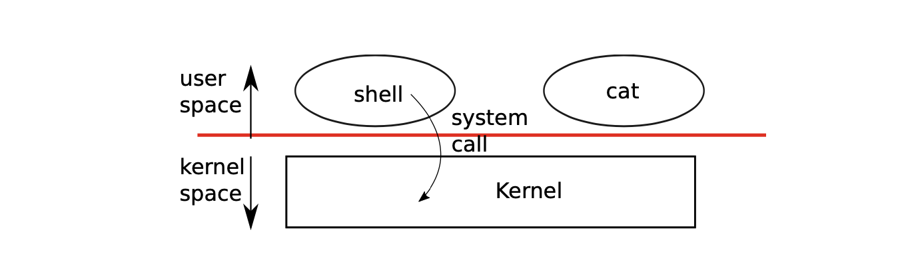

## o/s的目的

- 抽象硬件
- 多路复用
- 隔离：不允许不同的活动之间干扰
- 共享
- 安全性：安全的访问系统
- 性能：支持不同类型的applications
- 适用性：可以被广大用户使用

## o/s organization

- 组织：分层图片
- 用户应用程序：vi，gcc，DB和＆c 
- 内核服务 
- 硬件：CPU，RAM，磁盘，网络，＆c 
> *我们非常关心接口和内部内核结构



## O/S内核通常提供哪些服务？

- 进程（正在运行的程序）
- 内存分配
- 文件内容
- 文件名，目录
- 访问控制（安全性）
- 许多其他内容：用户，IPC，网络，时间，终端

## 什么是应用程序/内核接口？

- “系统调用”
- 在UNIX中用C语言编写的示例（例如Linux，macOS，FreeBSD）：

```
fd = open（“ out”，1）;
write（fd，“ hello \ n”，6）;
pid = fork（）;
```

> 这些看起来像函数调用，但不是

## UNIX系统调用简介

- 应用程序通过系统调用查看操作系统；该界面将成为重点。
- 我将展示一些示例，并在xv6上运行它们。
    - xv6具有与UNIX系统（例如Linux）相似的结构。但更简单-您将能够消化所有xv6。
    - 随书介绍了xv6的工作原理，以及为什么是UNIX？
        - 开源，文档完善，设计简洁，使用广泛
        - 如果您需要深入研究Linux，学习xv6将会有所帮助
        - xv6在6.S081中具有两个角色：
            - 核心功能示例：虚拟内存，多核，中断，＆c
            - 大多数lab的起点
            - xv6在RISC-V上运行，如当前的6.004
            - 您将在qemu机器模拟器下运行xv6


## 程序调用像`open（）`这样的系统调用时会发生什么？

看起来像一个函数调用，但这实际上是一个特殊的指令，硬件保存了一些用户寄存器，硬件增加特权级别，硬件跳到内核中的已知“入口点”，现在在内核中运行C代码。

内核调用系统调用实现 `open（），`在文件系统中查找名称，它可能会等待磁盘，它更新内核数据结构（缓存，FD表），恢复用户注册、降低特权级别，跳回到程序中的调用点，该调用点将继续。