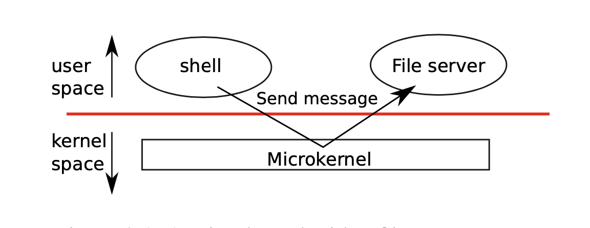

## 前言

主要内容： 

- 操作系统设计
  - 系统调用 
  - 微/整体内核 
- xv6中的第一个系统调用

---------------------------------------------------------

操作系统的目的：
- 运行多个应用程序
- 隔离他们（如果一个进程有错误和故障，不应影响不依赖于该错误进程的进程）
- 多路复用它们
- 共享（分时共享计算机资源）

每个应用程序甚至可以具有适合其需求的自己的库。应用程序可以直接与硬件资源进行交互，并以最佳方式为应用程序使用这些资源。嵌入式设备的某些操作系统或实时系统都是以这种方式组织的。

---------------------------------------------------------

有助于操作系统目标的Unix接口：
- 以实现目标的方式抽象硬件
- 进程（而不是核心）：fork
    - OS透明地将内核分配给进程
      - 保存和还原寄存器
    - 强制流程放弃
      - 定期重新分配核心
- 内存（而不是物理内存）：exec
    - 每个进程都有其“自己的”内存
    - 操作系统可以决定将应用程序放置在内存中的位置
    - 操作系统可以强制隔离不同应用程序的内存
    - 操作系统允许将图像存储在文件系统中
- 文件（而不是磁盘块）
    - 操作系统可以提供方便的名称
    - 操作系统可以允许进程/用户之间共享文件
- 管道（而不是共享的物理内存）
    - 操作系统可以停止发送器/接收器

---------------------------------------------------------

操作系统必须具有防御性
- 应用程序不应使OS崩溃
- 应用程序不应该脱离其隔离性
- **需要在应用程序和操作系统之间建立高度隔离**，为了实现高度隔离，禁止应用程序直接访问敏感内容很有帮助。
- **方法：硬件支持**
    - 用户/内核模式: 内核模式优先执行，用户模式非优先执行
    - 虚拟内存

操作系统应该能够清除失败的应用程序并继续运行其他应用程序。

为了实现强隔离，操作系统必须安排应用程序无法修改（甚至无法读取）操作系统的数据结构和指令并且该应用程序无法访问其他进程的内存。

CPU提供硬件支持以实现强隔离。

---------------------------------------------------------

处理器提供用户/内核模式
- 内核模式：可以执行“特权”指令
    - 例如，设置内核/用户位
    - 例如，对计时器芯片进行重新编程
- 用户模式：无法执行“特权”指令
- **操作系统在内核模式中运行，而applications在用户模式中运行**

---------------------------------------------------------

处理器提供虚拟内存
  - 硬件提供将**虚拟地址**转换为**物理地址**的页表
  - 定义应用程序可以访问的物理内存
  - **操作系统设置页表，以便每个应用程序只能访问其内存**

**应用必须能够与内核通信**
  - 写入共享的存储设备=>必须受保护=>在内核中
  - 退出应用
  ...

解决方案：添加指令以受控方式更改模式
  - 呼唤<n>
  - 在预先约定的入口点进入内核模式

---------------------------------------------------------

内核是可信计算库（TCB）
  - **内核必须“正确”**
    - 内核中的错误可能允许用户应用程序规避内核/用户
      - 在实践中经常发生，因为内核很复杂
      - 查看CVEs
  - **内核必须将用户应用程序视为可疑**
    - 用户应用可能会欺骗内核做错事
    - 内核必须仔细检查参数
    - 正确设置用户/内核
    - 等等。
  - **内核也负责分离应用程序**
    - 一个应用程序可能尝试读取/写入另一应用程序的内存
  =>需要安全倾向
    - 内核中的任何错误都可能是安全漏洞
  
---------------------------------------------------------

没有硬件支持的人是否可以进行进程隔离？

  是！使用强类型的编程语言

---------------------------------------------------------

单核 Monolothic kernel
  - **操作系统在内核空间中运行**
  - **内核接口==系统调用接口**
  - 一个包含文件系统，驱动程序和＆c的大程序
    - 良好：子系统易于协作，文件系统和虚拟内存共享一个缓存
    - 不好：互动很复杂，导致错误，内无孤立

monolithic kernel：整个操作系统都驻留在内核中，因此所有系统调用均在supervisor mode下运行。这种组织称为整体内核。

在这个组织中，整个操作系统都具有完整的硬件特权。这个组织很方便，因为操作系统设计师不必决定操作的哪一部分系统不需要完整的硬件特权。

整体组织的缺点是，组织的不同部分之间的接口操作系统通常很复杂（我们将在本文的其余部分中看到），因此操作系统开发人员容易犯错误。在整体内核中，有一个错误是致命的，因为supervisor mode下的错误通常会导致内核失败。如果内核失败，计算机停止工作，因此所有应用程序也会失败。计算机必须重新启动才能再次启动。

---------------------------------------------------------

微内核设计microkernel
  - 许多OS服务以普通用户程序运行
    - 文件服务器中的文件系统
  - 内核实现了在用户空间中运行服务的最小机制
    - 内存处理
    - 进程间通信（IPC）
  - 内核接口！=系统调用接口
  - 良好：更多隔离
  - 不好：可能很难获得良好的表现
  
  单核和微内核设计均被广泛使用

microkernel：在supervisor mode下运行的系统代码，并以用户模式执行大部分操作系统。这种内核组织称为微内核。

---------------------------------------------------------

User mode, supervisor mode, and system calls

机器模式，主管模式（内核模式）和用户模式：
- 机器模式下执行的指令具有完全特权
- CPU以机器模式启动。
- 机器模式主要用于配置计算机
- Xv6在机器模式下执行几行然后更改为主管模式。

- 在主管模式下，允许CPU执行特权指令：例如，启用和禁用中断，读取和写入保存页面地址的寄存器表等。
- 如果处于用户模式下的应用程序尝试执行特权指令，则CPU不执行指令，而是切换到主管模式，以便主管模式代码可以终止应用程序，因为它做了它不应该做的事情。
- 在内核空间中（supervisor mode）运行的软件称为内核。
- 想要调用内核功能（例如，xv6中的read系统调用）的应用程序必须过渡到内核。 CPU提供了一条特殊指令，可将CPU从用户模式切换进入supervisor mode，并在内核指定的入口点进入内核。RISC-V提供ecall指令。

