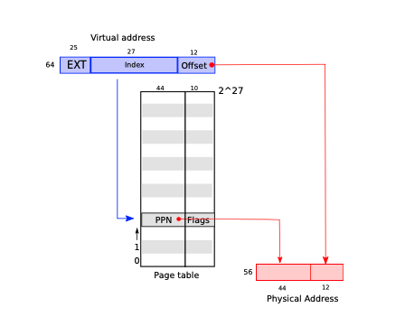
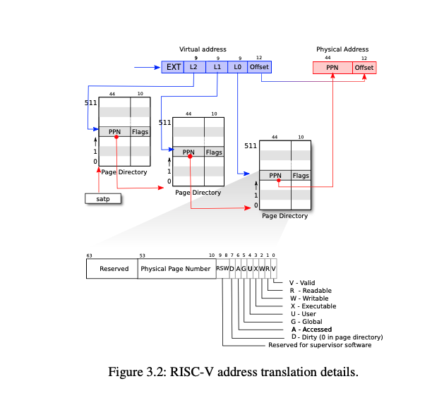

# 6.S081 2020 Lecture 4: Virtual Memory

* plan:
  - address spaces
  - paging hardware
  - xv6 VM code

##  concepts：

- **地址空间**(address space):
  - 所谓地址空间，是地址访问可以达到的所有地址的集合，而不是支持这个地址空间的全部硬件。就好比邮政编码是6位，它的地址空间就是10^6个地址，从0到999999。但不表示你需要有这么多个建筑区支持它。32位进程可以发出2^32个地址，比如*ptr=0xNNNNNNN，这个被访问的地址不一定有内存存在，只是说它可以发出这个地址而已。而这个地址对应什么物理内存，这是操作系统给的，给了就有，没给就没有。
  -  **包括物理空间以及虚拟空间**
  -  在操作系统中，地址空间指的是某个特定进程，在存储器[硬件]中所能够使用与控制的地址区段。
---------------------------------------------------------
* 分页提供了一种间接寻址的方式
* 页表确定什么是内存地址，以及可以访问物理内存的哪些部分。
* 它们允许xv6隔离不同进程的地址空间，并将它们多路复用到单个物理内存上。
* 页表由硬件提供。
* 在操作系统中使用**虚拟内存**，每个进程会认为使用一块大的连续的内存。事实上，每个进程的内存散布在物理内存的不同区域。或者可能被调出到备份存储中(一般在硬盘)。当一个进程请求自己的内存，操作系统负责把程序生成的虚拟地址，映射到实际存储的物理内存上。**操作系统在分页表中存储虚拟地址到物理地址的映射。每个映射被称为分页表项**（page table entry，PTE）。
---------------------------------------------------------
* RAM：随机存取存储器（英语：Random Access Memory，缩写：RAM），也叫主存。
* 与CPU直接交换数据的内部存储器。
* 可以随时读写（刷新时除外），而且速度很快，通常作为操作系统或其他正在运行中的程序的**临时数据存储介质**。
* RAM工作时可以随时从任何一个指定的地址写入（存入）或读出（取出）信息。
* 它与ROM的最大区别是数据的易失性，即一旦断电所存储的数据将随之丢失。
* RAM在计算机和数字系统中用来暂时存储程序、数据和中间结果
---------------------------------------------------------
* 物理内存：物理内存指通过**物理内存条**而获得的内存空间，而虚拟内存则是指将硬盘的一块区域划分来作为内存。
* 物理地址：二进制地址（binary address），它是在地址总线上，以电子形式存在的，使得数据总线可以访问主存（RAM）的某个特定存储单元的内存地址。
* 在使用**内存管理单元（MMU）**转换内存地址的计算机中，虚拟和物理地址分别指在经MMU转换之前和之后的地址。
* 在计算机网络中，物理地址有时又是MAC地址的同义词。这个地址实际上是用于数据链路层，而不是如它名字所指的物理层上。
---------------------------------------------------------
* 虚拟内存：使得应用程序认为它拥有连续的可用的内存（一个连续完整的地址空间），而实际上，它通常是被分隔成多个物理内存碎片，还有部分暂时存储在外部磁盘存储器上，在需要时进行数据交换。与没有使用虚拟内存技术的系统相比，使用这种技术的系统使得大型程序的编写变得更容易，对真正的物理内存（例如RAM）的使用也更有效率。目前，大多数操作系统都使用了虚拟内存，如Windows家族的“虚拟内存”；Linux的“交换空间”等。
---------------------------------------------------------
* MMU：内存管理单元。
* CPU寻址的方式：
  - 未使用MMU：CPU发出地址(**PA**) 直接内存寻址(SDRAM or DDRx)。
  - 使用MMU：CPU发出地址(**VA**) MMU接收CPU发来的地址 经过某种转换变成实际的物理地址去寻址。

## Virtual memory overview

* 在现代的操作系统中，为了让其他的程序能方便的运行在操作系统上，需要完成的一个很重要的抽象是「每个程序有自己的地址空间，且地址空间范围是一样的」，这将会减少了上层程序的大量麻烦，否则程序本身要维护自己需要的物理内存，这也会导致极大程度的不安全。

这个执行上看到的地址空间，就是虚拟内存。而访问虚拟内存的地址就是虚拟地址（Virtual Address），与之对应的是物理地址（Physical Address）。这样的设计会导致上层的应用程序可能会访问同一个值相等的虚拟地址，所以操作系统需要做的就是替这些程序维护这个虚拟地址到物理地址的映射。甚者，为了统一和连贯，内核自己本身访问内存也将会通过虚拟地址。

---------------------------------------------------------
* we want isolated address spaces【**隔离地址空间**】
  - each process has its own memory【内存】
  - it can read and write its own memory【**只能读取自己的内存**】
  - it cannot read or write anything else
  - challenge: 
    - how to multiplex several memories over one physical memory?
	while maintaining isolation between memories【物理内存上复用多个内存，同时保持隔离】
---------------------------------------------------------
* 
  CPU[中央处理器] -> MMU[内存管理单元] -> RAM[随机存取存储器]

                 VA                PA
  - VA：虚拟地址
  - PA：物理地址
  - software只能ld/st到虚拟地址，而不是物理地址
  - **内核告诉MMU如何将每个虚拟地址映射到物理地址**
    - MMU本质上有一个表，由va索引，产生pa，称为“页表”
    - 每个地址空间一个页表
  - MMU可以限制用户代码可以使用的虚拟地址
  - 通过对MMU进行编程，内核可以完全控制`va->pa`映射
    - 允许许多有趣的OS功能/技巧
---------------------------------------------------------
* RISC-V maps 4-KB "pages" and aligned -- start on 4 KB boundaries
  - 4 KB = 12 bits
  - the RISC-V used in xv6 has 64-bit for addresses thus page table index is top 64-12 = 52 bits of VA
  - except that the top 25 of the top 52 are unused
  - no RISC-V has that much memory now can grow in future so, index is 27 bits.
---------------------------------------------------------
* MMU translation
  - see Figure 3.1 of book
  - use index bits[索引位] of VA to find a page table entry (PTE)
  - construct physical address **using PPN from PTE + offset of VA**

  
---------------------------------------------------------
* what is in PTE? 页表入口
  - see Figure 3.2 of book
  - each PTE is 64 bits, but only 54 are used
  - top 44 bits of PTE are top bits of physical address："physical page number"
  - low 10 bits of PTE flags
    - Present, Writeable, &c
    - 每个PTE包含flags，这些flags告诉paging硬件如何允许使用关联的虚拟地址
  - note: size virtual addresses != size physical addresses
---------------------------------------------------------
* page-table 存储在哪里?
  - in RAM -- MMU loads (and stores) PTEs
  - o/s can read/write PTEs
    - read/write memory location corresponding to PTEs   
---------------------------------------------------------
* 页表只是一个PTE数组是否合理？它有多大？
  - 2^27 is roughly 134 million
  - 每个entry是64位
  - 整个page-table是134 * 8 MB
    - 每个page浪费约1GB
    - 每个地址空间一个页表
    - 每个应用程序一个地址空间
  - 将浪费大量内存用于小型程序！
    - 只需要几百个page的映射
    - 因此，其余的100万个entry将在那里但不需要
---------------------------------------------------------
* RISC-V 64 uses a "three-level page table" to save space
  - see figure 3.2 from book
  - page directory page (PD)
    - PD has 512 PTEs
    - PTEs point to another PD or is a leaf
    - so 512*512*512 PTEs in total
  - PD entries can be invalid
    - those PTE pages need not exist
    - leaving it up to the kernel to handle the exception 
    - so a page table for a small address space can be small
---------------------------------------------------------
* how does the mmu know where the page table is located in RAM?
  - satp寄存器存储着顶部page directory的物理地址
  - 要告诉硬件使用页表，内核必须将根页表页的物理地址写入satp寄存器。
  - 页可以在RAM中的任何位置-不必连续
  - 切换到另一个地址空间/应用程序时重写satp
---------------------------------------------------------

* how does RISC-V paging hardware translate a va?
  - 具体来说，假设我们有虚拟地址 (VPN2, VPN1, VPN0, offset)：
  - 我们首先会记录装载「当前所用的三级页表的物理页」的页号到 satp 寄存器中；
  - 把VPN2作为偏移，在三级页表的物理页中找到第二级页表的物理页号；
  - 把VPN1作为偏移在二级页表的物理页中找到第一级页表的物理页号；
  - 把VPN0作为偏移在一级页表的物理页中找到要访问位置的物理页号；
  - 物理页号对应的物理页基址加上 offset 就是虚拟地址对应的物理地址。

我们通过这种复杂的手段，终于从虚拟页号找到了一级页表项，从而得出了物理页号。刚才我们提到若页表项满足 R,W,X 都为 0，表明这个页表项指向下一级页表。在这里三级和二级页表项的 R,W,X 为 0 应该成立，因为它们指向了下一级页表。

然而三级和二级页表项不一定要指向下一级页表。我们知道每个一级页表项控制一个虚拟页号，即控制 4KB 虚拟内存；每个二级页表项则控制 9 位虚拟页号，总计控制`4KB×2^9=2MB` 虚拟内存；每个三级页表项控制 18 位虚拟页号，总计控制`2MB×2^9=1GB` 虚拟内存。我们可以将二级页表项的 R,W,X 设置为不是全 0 的，那么它将与一级页表项类似，只不过可以映射一个 2MB 的大页（Huge Page）。同理，也可以将三级页表项看作一个叶子，来映射一个 1GB 的大页。这样在 RISC-V 中，可以很方便地建立起大页机制。

---------------------------------------------------------
* flags in PTE
  - V, R, W, X, U
> xv6 uses all of them
---------------------------------------------------------
* what if V bit not set? or store and W bit not set?
  - "page fault"
  - forces transfer to kernel
    - trap.c in xv6 source
  - kernel can just produce error, kill process
    in xv6: "usertrap(): unexpected scause ... pid=... sepc=... stval=..."
  or kernel can install a PTE, resume the process
    - e.g. after loading the page of memory from disk
---------------------------------------------------------
* indirection allows paging h/w to solve many problems
  - e.g. phys memory doesn't have to be contiguous
    - avoids fragmentation
  - e.g. lazy allocation (a lab)
  - e.g. copy-on-write fork (another lab)
  - many more techniques
  - topic of next lecture

## Virtual memory in xv6

* kernel page table 
  See figure 3.3 of book
  simple maping mostly
    map virtual to physical one-on-one
  note double-mapping of trampoline
  note permissions
  why map devices?

---------------------------------------------------------
* 每个进程都有自己的内存地址和自己的page table, 图3.4
    - note: trampoline and trapframe aren't writable by user process
  - 切换进程时，内核切换page table（eg：设置 satp）

---------------------------------------------------------
* Q: why this address space arrangement?
  - user virtual addresses start at zero, 
    of course user va 0 maps to different pa for each process
  - 16,777,216 GB for user heap to grow contiguously, but needn't have contiguous phys mem -- no fragmentation problem
  - both kernel and user map trampoline and trapframe page
    - eases transition user -> kernel and back
    - kernel doesn't map user applications
  - not easy for kernel to r/w user memory
    - need translate user virtual address to kernel virtual address
    - good for isolation (see spectre attacks)
  - easy for kernel to r/w physical memory
    - pa x mapped at va x